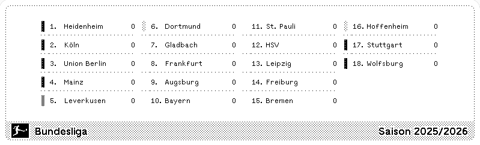
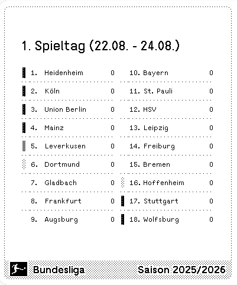
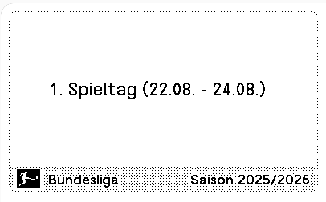

# Bundesliga Results App for TRMNL

A lightweight web application for [TRMNL](https://usetrmnl.com) that displays **current Bundesliga matchday fixtures** and the **latest league table**, using live data from the [OpenLigaDB API](https://www.openligadb.de/).

## Features

-   📅 **Matchday Overview** – All games with date, time, and results (live or final)
-   📊 **League Table** – Updated standings with visual indicators for Champions League, Europa League, Conference League and relegation
-   🔄 **Live Data** – Automatically updated via OpenLigaDB API
-   🖥 **Optimized for TRMNL** – Four HTML layout versions to suit different display configurations

## Demo

### Full Layout

### Half Horizontal Layout

### Half Vertical Layout

### Quadrant Layout

## Layouts Included

-   `buli_full.html` – Full-screen view
-   `buli_half-horizontal.html` – Top/bottom split view
-   `buli_half-vertical.html` – Left/right split view
-   `buli_quadrant.html` – One-quarter screen view

## API Endpoints Used

-   `getbltable/bl1/{year}` – Current Bundesliga table
-   `getmatchdata/bl1` – Current matchday fixtures

## Technologies

-   HTML5
-   CSS3
-   Vanilla JavaScript (ES6)
-   OpenLigaDB API

## Author

**Philipp Heldt**  
📧 design@philippheldt.de  
🐙 [GitHub](https://github.com/philippheldt)
